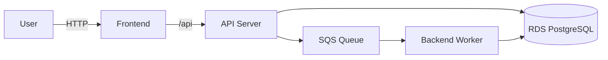

# terraform-demo

A demo showing Terraform provisioning AWS infrastructure and deploying a small web application to Kubernetes

## What is running at the end

A sample web application showing a job queue dashboard where users submit jobs with a configurable duration. A background worker picks them up via SQS, simulates processing, and marks them complete.

| Major component | Description |
|---|---|
| **VPC** | All networking and routing |
| **EKS** | frontend, API server, and background worker running as Kubernetes workloads |
| **ECR** | Container registry |
| **RDS** | PostgreSQL database holding the job state, stored in a private subnet and only reachable from the cluster |
| **SQS** | AWS Simple Queue Service - decouples job submission from processing |
| **Grafana** | cluster observability at /monitoring |
| **Concourse CI** | CI/CD pipelines for provisioning infrastructure and deploying services, running inside the cluster |

## Infrastructure and code layout

Folder layout:
| Folder | Purpose |
|---|---|
| /terraform | The terraform to deploy the infra, split into 5 layers |
| /k8s | The kubernetes manifest YAMLs |
| /scripts | Helper Scripts |
| /services | The same web application, architected as 3 microservices (frontend, api server and backend) |
| /concourse | Concourse Server configuration |

Provisioned with Terraform across five layers applied in order:

| Folder | What it creates |
|---|---|
| modules | base modules that can be reused |
| 0-networking-infra | VPC, subnets, NAT gateway, VPC flow logs |
| 1-eks-infra | EKS cluster, managed node group, ECR |
| 2-post-eks-config | Kubernetes StorageClass |
| 3-rds-infra | RDS PostgreSQL, password in SSM Parameter Store |
| 4-sqs-infra | SQS job queue and dead-letter queue |

Each layer reads the previous layer outputs from S3 remote state. Terraform is the source of truth - the running environment should always match what is in code.

## Sample Web Application ##

There are 3 microservices: frontend, api service (REST) and backend worker that are deployed as separate k8s which allows us to scale each service independantly.  In a real scenario, the frontend would be a CDN like CloudFront, but deployed in this demo as a container.  When the ingress is deployed and the loadbalancer created, users can access the following:

| URL path | description |
|---|---|
| `/` | frontend |
| `/api` | api server |
| `/monitoring` | Grafana |
| (separate LB) | Concourse |

## Running it

**Note** for security reasons, I suggest only opening up the EKS API to yourself or bad people on the internet could make you have a bad day.  See the `api_server_allowed_cidrs = ["1.2.3.4/32"]` in the eks module to whitelist your IP.

One-time backend setup (S3 state bucket and DynamoDB lock table):

    ./scripts/bootstrap-terraform-backend.sh

Apply infrastructure -- Go into each terraform folder above and run them in order:

    terraform init && terraform apply

Install Concourse into the cluster, then register and run the remaining pipelines:

    ./scripts/install-concourse-eks.sh
    ./scripts/set-pipelines.sh

Then use concourse to deploy the services.  Concourse will check out the code from git, run the `docker build` and `docker push` to ECR, then run `kubectl apply` to deploy the manifests to the cluster.

Tear down when not actively working to avoid unnecessary costs:

    ./scripts/teardown.sh
